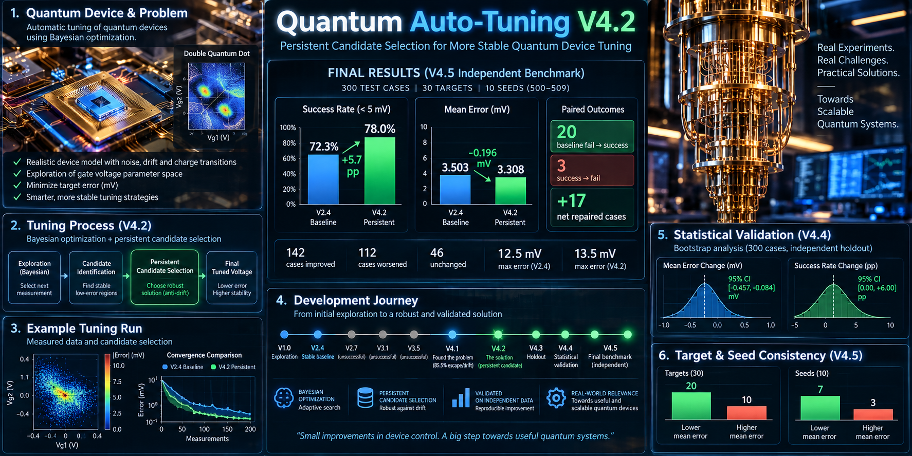

# ⚛️ Quantum Auto-Tuning

### Autonomous Quantum Device Optimization with Bayesian Optimization & Persistent Candidate Selection

An experimental research and engineering project exploring how autonomous optimization can tune simulated quantum-device control parameters under noisy measurement conditions.

The project evolved from a simple **V1.0 tuning experiment** into a validated **V4.2 Persistent Candidate Selection** architecture through repeated experimentation, benchmarking, failure analysis and independent validation.

---

## 🎯 Project Goal

The goal is to develop an autonomous tuning system capable of:

- Exploring quantum-device control parameters
- Minimizing tuning error
- Operating under noisy measurements
- Detecting stable candidate regions
- Reducing optimization drift
- Making robust tuning decisions automatically

---

## 🧠 Development Journey

The project was developed iteratively rather than around a single final algorithm.

**V1.0 — Exploration**  
Initial automatic tuning experiments and baseline search strategies.

**V2.0 — Bayesian Optimization**  
Introduced Gaussian Process modelling and Expected Improvement for measurement-efficient search.

**V2.4 — Stable Bayesian Baseline**  
Adaptive stopping based on stability and model uncertainty.

**V2.7 / V3.1 / V3.5 — Experimental Approaches**  
Local refinement and validation strategies were tested. Several approaches failed to generalize, providing useful diagnostic information.

**V4.1 — Failure Mechanism Analysis**  
Large-scale diagnostics revealed that **85.5% of failed baseline runs had previously reached within 5 mV of the simulated target before drifting away**.

**V4.2 — Persistent Candidate Selection**  
A target-independent anti-drift strategy was introduced to retain historically supported candidate regions rather than relying only on the latest estimated optimum.

**V4.3–V4.5 — Independent Validation**  
The frozen V4.2 strategy was evaluated on new targets and random seeds without retuning its parameters.

---

## 📊 Final Independent Benchmark

**300 test cases · 30 targets · 10 new random seeds**

| Metric | V2.4 Baseline | V4.2 Persistent |
|---|---:|---:|
| Success rate (<5 mV) | 72.3% | **78.0%** |
| Mean error | 3.503 mV | **3.308 mV** |
| Median error | 3.000 mV | **2.854 mV** |
| Baseline failures repaired | — | **20** |
| Successful cases lost | — | **3** |
| Net repaired cases | — | **+17** |

V4.2 achieved a **+5.7 percentage-point increase in success rate** and reduced mean tuning error by approximately **0.196 mV** on the final independent benchmark.

---

## 🔬 Statistical Validation

A separate 300-case holdout evaluation showed:

- Mean error change: **−0.265 mV**
- Bootstrap 95% CI: **[−0.457, −0.084] mV**
- 19/30 targets showed lower mean error
- 7/10 random seeds showed lower mean error

The results indicate that Persistent Candidate Selection can reduce average tuning error while improving robustness against optimization drift in this simulation environment.

---

## 🛠️ Technologies

- Python
- NumPy
- SciPy
- scikit-learn
- Gaussian Processes
- Bayesian Optimization
- Expected Improvement
- Statistical Validation
- Monte Carlo / noisy simulation
- Quantum-device tuning concepts

---

## 💡 Key Insight

The most important discovery was that optimization failure did not always mean the algorithm failed to find the correct region.

In many cases, the tuner **found a highly accurate region and later drifted away from it**.

This shifted the project from simply improving exploration toward preserving reliable historical information.

That insight became the foundation of **Persistent Candidate Selection**.

---

## ⚠️ Scope

This project currently uses a **simulated quantum-device response model** with measurement noise.

The benchmark results therefore demonstrate algorithmic performance within the simulation environment and should not be interpreted as experimental quantum-hardware results.

A natural next step would be validation against more realistic device models or real quantum-hardware measurements.

---

## 🚀 Project Status

**V4.2 algorithm: Frozen**  
**Independent benchmark: Completed**  
**Statistical validation: Completed**  
**Final benchmark: Completed**

### From experimentation → failure analysis → validated improvement.

**Same physics. Better decisions. Real progress.**
